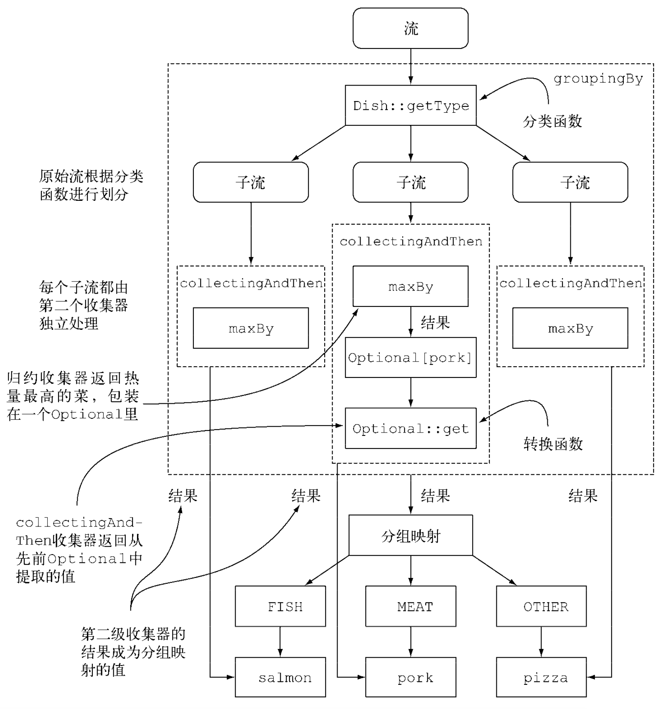

## 规约(reduction operation)

* `collect()`  收集器

* `Collector`

  Collector 作为collect方法的参数。是一个接口，它是一个**可变(mutable)**的汇聚操作，将输入元素累积到一个可变的结果容器(mutable result container)中；它会在所有元素都处理完毕之后，将累积的结果转换为一个最终的表示(这是一个可选操作)；它支持串行与并行两种方式。

  ```java
  A Collector is specified by four functions that work together to accumulate entries into a mutable result container, and optionally perform a final transform on the result.  They are: 
     <1>creation of a new result container ({@link #supplier()})
     <2>incorporating(合并) a new data element(流中的元素) into a result container ({@link #accumulator累加器()})
     <3>combining two result containers into one ({@link #combiner()})
     <4>performing an optional final transform on the container ({@link #finisher()})
  ```

  

* `Collectors` 

  `public final class Collectors`，是一个final修饰的工厂类，实现了Collector接口中的一系列有用的mutable reduce operation。

* `reduce()`
* `sum()`、`max()`、`count()`...

参考：[流的规约操作汇总介绍](https://github.com/CarpenterLee/JavaLambdaInternals/blob/master/5-Streams%20API(II).md)

#### <a name="fenced-code-block">收集器：定义collect用来生成结果集合的标准</a>

**1. 将流元素规约和汇总为一个值**

* `Collectors.counting()`

````java
long count1 = menu.stream().collect(Collectors.counting());
long count2 = menu.stream().count();
````

* `Collectors.minBy()` / `.maxBy()`

````java
menu.stream().collect(Collectors.minBy(Comparator.comparingInt(Dish::getCalories))).ifPresent(System.out::println);
````
* `Collectors.summingInt()` / `.summingDouble()` / `.summingLong()`

````java
long sum = menu.stream().collect(Collectors.summingInt(Dish::getCalories));
````
* `Collectors.averagingInt()` / `.averagingDouble()` / `.averagingLong()`

````java
double avr = menu.stream().collect(Collectors.averagingInt(Dish::getCalories));
````
* `Collectors.summarizingInt()` / `.summarizingDouble()` / `.summarizingLong()`

````java
IntSummaryStatistics statistics = menu.stream().collect(Collectors.summarizingInt(Dish::getCalories));
System.out.println(statistics.getAverage());   // 466.6666666666667
System.out.println(statistics.toString());     // IntSummaryStatistics{count=9, sum=4200, min=120, average=466.666667, max=800}
````

* `Collectors.join()`

````java
String names = menu.stream().map(Dish::getName).collect(Collectors.joining(","));
````

注：*以上规约操作，其实是常用规约操作的特殊化(源码实现)，为了方便使用、可读性*，**下面来看规约操作的一般情况：**

* `reducing(U identity, Function<? super T, ? extends U> mapper, BinaryOperator<U> op)`

identity：初始值；mapper：转换函数；op：累积函数。

利用累积函数，把一个初始化为初始值的累加器，和把转换函数应用到流中每个元素上得到的结果不断迭代合并起来。

````java
long commonSum = menu.stream().collect(Collectors.reducing(0, Dish::getCalories, (i, j) -> i + j));
long commonSum = menu.stream().collect(Collectors.reducing(0, Dish::getCalories, Integer::sum));
````

**2. 元素分组**

* `Collectors.groupingBy()`

````java
Map<Type, List<Dish>> group = menu.stream().collect(Collectors.groupingBy(Dish::getType));
// {FISH=[prawns, salmon], OTHER=[french fries, rice, season fruit, pizza], MEAT=[pork, beef, chicken]}

// 自定义分组规则
Map<CaloricLevel, List<Dish>> group1 = menu.stream().collect(Collectors.groupingBy(d -> {
    if (d.getCalories() <= 400) {
        return CaloricLevel.DIET;
    } else if (d.getCalories() <= 700) {
        return CaloricLevel.NORMAL;
    } else {
        return CaloricLevel.FAT;
    }
}));
````

多级分组：把第二个groupBy收集器传递给第一个收集器，实现多级分组

````java
Map<Type, Map<CaloricLevel, List<Dish>>> group2 = menu.stream().collect(Collectors.groupingBy(Dish::getType,
        Collectors.groupingBy(d -> {
            if (d.getCalories() <= 400) {
                return CaloricLevel.DIET;
            } else if (d.getCalories() <= 700) {
                return CaloricLevel.NORMAL;
            } else {
                return CaloricLevel.FAT;
            }
        })
));
// {FISH={DIET=[prawns], NORMAL=[salmon]}, OTHER={DIET=[rice, season fruit], NORMAL=[french fries, pizza]}, MEAT={FAT=[pork], DIET=[chicken], NORMAL=[beef]}}
````

按子组收集数据

````java
Map<Type, Long> group3 = menu.stream().collect(Collectors.groupingBy(Dish::getType, Collectors.counting()));
// {FISH=2, OTHER=4, MEAT=3}
````

````java
Map<Type, Optional<Dish>> group4 = menu.stream().collect(Collectors.groupingBy(
        Dish::getType,	// 以此对流中元素进行一级分组
        Collectors.maxBy(Comparator.comparing(Dish::getCalories)) // 对同一分组中的流元素进行进一步规约操作
));
// {FISH=Optional[salmon], OTHER=Optional[pizza], MEAT=Optional[pork]}
````

`Collectors.collectingAndThen()`、`.collectingAndThen()`

````java
Map<Type, Dish> group5 = menu.stream().collect(Collectors.groupingBy(
        Dish::getType,
        Collectors.collectingAndThen(
                Collectors.maxBy(Comparator.comparing(Dish::getCalories)),
                Optional::get
        )
));
// {FISH=salmon, OTHER=pizza, MEAT=pork}

````

```java
// select name, count(*) from User group by name;
Map<String, Long> count = users.stream().collect(Collectors.groupingBy(User::getName, Collectors.counting()));
System.out.println(count);

Map<String, Double> average = users.stream().collect(Collectors.groupingBy(User::getName, Collectors.averagingLong(User::getAge)));
System.out.println(average);

Map<Boolean, List<User>> partition = users.stream().collect(Collectors.partitioningBy(user -> user.getAge() > 20));
System.out.println(partition);
```

*嵌套收集器分组效果流程如下图：*


**3. 元素分区**


* `Collectors.partitioningBy(predicate)`、`.partitioningBy(predicate, downstream)`

````java
Map<Boolean, List<Dish>> partition = menu.stream()
        .collect(
                Collectors.partitioningBy(Dish::isVegetarian)
        );
// {false=[pork, beef, chicken, prawns, salmon], true=[french fries, rice, season fruit, pizza]}

Map<Boolean, Map<Type, List<Dish>>> partiton2 = menu.stream()
        .collect(
                Collectors.partitioningBy(Dish::isVegetarian, Collectors.groupingBy(Dish::getType))
        );
// {false={FISH=[prawns, salmon], MEAT=[pork, beef, chicken]}, true={OTHER=[french fries, rice, season fruit, pizza]}}

// 分别输出20以内的质数和非质数
Map<Boolean, List<Integer>> partitions = IntStream.rangeClosed(2, n).boxed()
        .collect(Collectors.partitioningBy(
                item -> IntStream.rangeClosed(2, (int) Math.sqrt((double)item)).noneMatch(i -> item % i == 0)
        ));
````