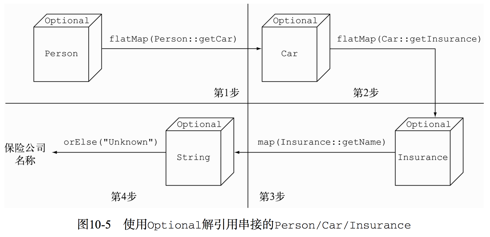

### Optional
java 一直试图避免让程序猿意识到指针的存在，唯一的例外是：null 指针！

#### <a name="fenced-code-block">java.util.Optional*&lt;*T></a>

变量存在时，Optional类只是对类的简单封装；变量不存在时，缺失的值会被建模成一个“空”的Optional对象，由方法`Optional.empty()`返回。

如果你尝试引用一个null，一定会触发NPE，不过使用Optional.empty()就完全没事儿，它返回的是一个Optional类的有效对象。

引入Optional类的意图并非要消除每一个null引用。与此相反，它的目标是帮助开发者设计出普适的API，让开发者看到方法签名，就能了解它是否接受一个Optional的值。这种强制会让你更积极地将变量从Optional中解包出来，直面缺失的变量值。

#### <a name="fenced-code-block">应用Optional的几种模式</a>

* 创建Optional对象

  Optional对象是一个value-base class，它的构造方式私有的，只能通过以下三种静态工厂方法创建：

````java
Optional<Car> optCar = Optional.empty();  // 声明一个空的Optional
Optional<Car> optCar = Optional.of(car);  // 依据一个非空值创建Optional。如果car为null，则抛出NPE
Optional<Car> optCar = Optional.ofNullable(car);  // 可接受null的Optional。如果car是null，则得到的Optional对象就是个空对象，不是null
````

* 使用map从Optional对象中提取和转换值

````java
Optional<Insurance> opt = Optional.ofNullable(insurance);
Optional<String> name = opt.map(Insurance::getName);  // 如果opt为空，则什么都不做
name.ifPresent(n -> System.out.println(n)); // 不要使用 if(name.isPresent()) {}
````

* 使用flatMap链接Optional对象

````java
private String getCarInsuranceName(Person person) {
	return person.filter(p -> p.getAge > 5)	// 使用filter对Optional对象过滤
        .flatMap(Person::getCar)	// map()返回的是Optional<Optional<Car>>，为嵌套optional
        .flatMap(Car::getInsurance)	// flatMap()返回的是Optional<Car>
        .map(Insurance::getName)	// Optional对象不支持getName()
        .orElse("Unknown");			// 如果Optional的结果值为空，设置默认值
}
````


* 基本类型：OptionalInt、OptionalDouble、OptionalLong
	* 扩展提供了 `public int getAsInt()`方法；
	* 基本类型的Optional不支持map()、flatMap()、filter()方法；

#### <a name="fenced-code-block">解引用Optional对象</a>

* `get()` : 最简单但又最不安全
* `orElse(T other)` : Optional对象不存在值时，提供一个默认值
* `orElseGet(Supplier other)` ：Optional对象不存在值时，执行other方法
* `orElseThrow(Supplier excpOther)` ： Optional对象不存在值时，抛出定制的other异常
* `ifPresent(Consumer other)`：Optional对象值存在时，执行作为参数传入的other方法，否则不做任何操作
