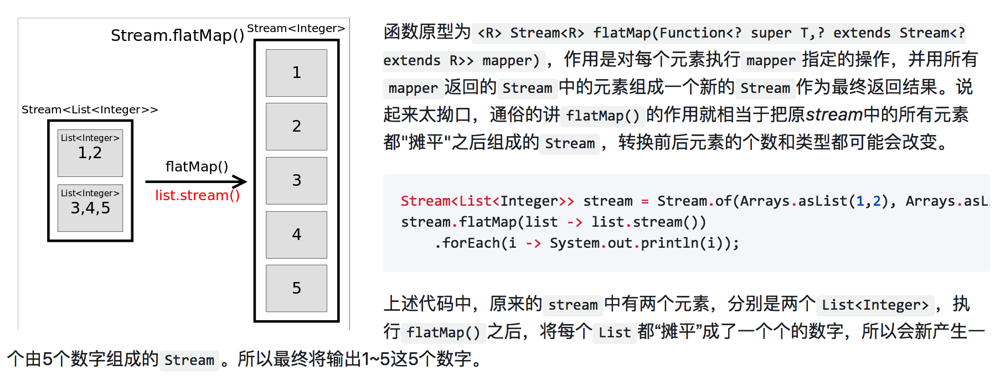
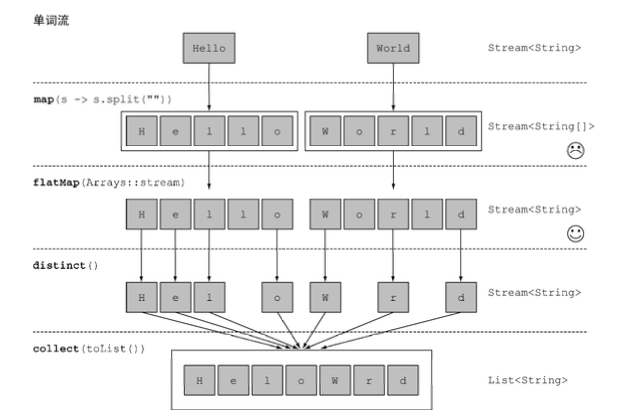
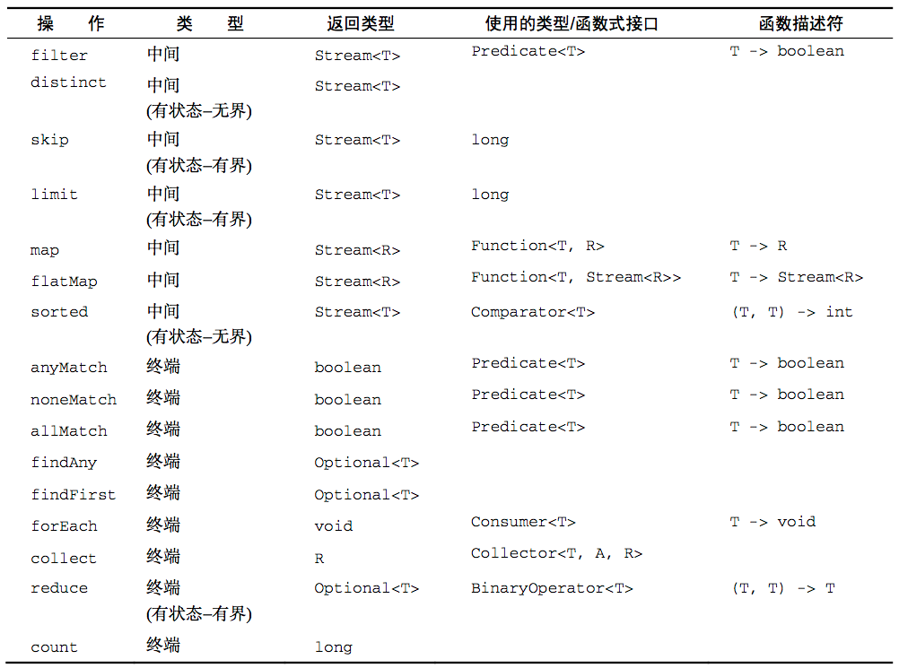

#### Stream

**stream 并不是某种数据结构，它只是数据源的一种<font color="orange">视图</font>。这里的数据源可以是一个数组，Java容器或I/O channel等**。<a name="fenced-code-block">流：从支持数据处理操作的源生成的元素序列</a>

* 集合讲的是数据，流讲的是计算。流的目的在于表达计算
* 从有序集合生成流时会保留原有的顺序。由列表生成的流，其元素顺序与列表一致
* 流操作可以顺序执行，也可以并行执行
* 在调用collect之前，没有任何结果产生，实际上根本就没有从menu里选择元素。链中的方法都在等待，直到调用collect

##### <a name="fenced-code-block">流特点：</a>

1. 流只能被遍历一次，遍历完之后，流就被消费掉了。如需再次遍历，需要重新构造流，否则会抛异常
2. 外部迭代(集合)与内部迭代(流)

##### <a name="fenced-code-block">stream与collections有以下不同：</a>

* **无存储**。stream不是一种数据结构，它只是某种数据源的一个视图
* **为函数式编程而生**。对stream的任何修改都不会修改背后的数据源，比如对stream执行过滤操作并不会删除被过滤的元素，而是会产生一个不包含被过滤元素的新stream。
* **惰式执行**(Streams are lazy)。stream上的中间操作并不会立即执行，只有等到用户真正需要结果(执行终端操作)的时候才会执行。

```java
// 由于没有终端操作，以下方法没有任何输出！
Stream.of("hello", "world", "helloworld").map(s -> {
    System.out.println("====");
    return s.toUpperCase();
});
```

* **可消费性**。stream只能被“消费”一次，一旦遍历过就会失效，就像容器的迭代器那样，想要再次遍历必须重新生成。

##### <a name="fenced-code-block">流操作：</a>

1. Stream source
2. 零个或多个中间操作(intermediate operations)：总是会惰式执行，调用中间操作只会生成一个标记了该操作的新stream，仅此而已。如filter/map/limit/sort等。各种中间操作优化执行、短路、循环合并
3. 一个终端操作(terminal operation)：会触发实际计算，计算发生时会把所有中间操作积攒的操作以pipeline的方式执行，这样可以减少迭代次数。计算完成之后stream就会失效。终端操作会从流的流水线生成结果。执行流水线，并生成结果。如collect/forEach/count等

##### 构造流

- 由值创建流。通过Stream接口的of静态方法创建一个流

```java
Stream<String> stream = Stream.of("I", "love", "you", "too");
Stream<String> stream = Stream.empty();
```

- 由数组/集合创建流。

  通过Arrays类的stream方法，实际上第一种of方法底层也是调用的Arrays.stream(values);

  通过集合的stream方法，该方法是Collection接口的默认方法，所有集合都继承了该方法。

```java
Arrays.stream("135,7,91".split(",")).map(d -> d.length()).count();
Stream<String> stream3 = Arrays.asList("hello","world","helloworld").stream();
```

- 由文件生成流

```java
try (Stream<String> lines = Files.lines(Paths.get("~/test.txt"), Charset.defaultCharset())) {
    long allWords = lines.flatMap(line -> Arrays.stream(line.split(" "))).distinct().count(); // 使用flatMap生成一个扁平的流，而不是使用map为各行生成一个流！
} catch (IOException e) {...}
```

- 由函数生成流

```java
Stream.generate(Math::random).limit(10).forEach(System.out::println);
Stream.iterate(0, n -> n+2).limit(10).forEach(System.out::println);
```

```java
Stream.iterate(new int[]{0, 1}, t -> new int[]{t[1], t[1]+t[0]}).limit(10).map(t -> t[0]).forEach(System.out::println); // 打印斐波拉契数列
```

#### <a name="fenced-code-block">使用流：</a>

##### 筛选和切片

* 用谓词筛选 filter(()->{})
* 筛选各异元素 distinct()
* 截断流 limit(n)

````java
List<Dish> dishes = menu.stream()
  .filter(d -> d.getCalories() > 400).limit(3).collect(Collectors.toList());
````
* 跳过元素 skip(n)
* 输出流被消费后的结果，适合DEBUG peek()

````java
Optional<Integer> r1 = Arrays.asList(1,2,3,4,5).stream()
                .map(x -> x * x)
                .peek(m -> log.info("mapedValue: {}", m))
                .filter(x -> x % 3 == 0)
                .peek(m -> log.info("filteredValue: {}", m))
                .findFirst();
````

##### 映射

* 对流中每一个元素应用函数 map 返回值：stream
	* 函数的返回值类型就是流的类型
* 流的扁平化 flatMap  返回值：stream
	* flatMap 方法把一个流中的每个值都换成另一个流，然后把所有的流连接起来成为一个流。注意：flatMap()方法的入参是一个Stream<T>包装类型的。
	




````java
Lists.newArrayList("hello world", "welcome world")
        .stream()
        .map(item -> item.split(" "))  // Stream<String[]>
        .flatMap(Arrays::stream)       // Stream<String>
        .distinct()
        .forEach(System.out::println);

List<String> h1 = Lists.newArrayList("hi", "hello", "你好");
List<String> h2 = Lists.newArrayList("zhangsan", "lisi", "wangwu", "zhaoliu");
h1.stream()
  			.flatMap(item1 -> h2.stream().map(item2 -> item1 + ", " + item2))
  			.forEach(System.out::println);

Stream<String> stream1 = Stream.of("hello", "world");
stream1.map(w -> w.split(""))
        .flatMap(Arrays::stream)
        .distinct()
        .collect(Collectors.toList())
        .forEach(i -> System.out.println(i));
````

##### 查找和匹配

* 检查谓词是否至少匹配一个元素 anyMatch 返回值：Optional

````java
if (menu.stream().anyMatch(Dish::isVegetarian)) {// 菜单中有素食}
````
* 检查谓词是否匹配所有元素 allMatch 或 noneMatch 返回值：boolean

````java
if (menu.stream().allMatch(d -> d.getCalories < 1000)) {// 菜单中所有食物热量都小于1000}
````
````java
if (menu.stream().noneMatch(d -> d.getCalories >= 1000)) {// 菜单中所有食物热量都小于1000}
````

* 查找元素 findAny 返回值：Optional

````java
Optional<Dish> dish = menu.stream().filter(Dish::isVegetarian).findAny();
menu.stream().filter(Dish::isVegetarian).findAny().ifPresent(d -> log.info(d.getName()));
````

* 查找第一个元素 findFirst  返回值：Optional

````java
Optional<Integer> r = Arrays.asList(1,2,3,4,5).stream().map(x -> x * x).filter(x -> x % 3 == 0).findFirst();
````

##### 规约 (reduce：将流规约成一个值)

* 元素求和

reduce 接受两个参数：一个是初始值，一个是BinaryOperator<T>的Lambda来将两个元素结合起来产生一个新值

````java
int sum = numbers.stream().reduce(0, (a, b) -> a + b);
````
Java 8中，Integer类提供了一个静态的sum方法来对两个数求和：

````java
int sum = numbers.stream().reduce(0, Integer::sum);
````

reduce的一个重载函数，不接受初始值，会返回一个Optional对象

````java
Optional<Integer> sum = numbers.stream().reduce((a, b) -> a + b);
````

* 最大值和最小值

````java
Optional<Integer> max = numbers.stream().reduce(Integer::max);
````

````java
Optional<Integer> min = numbers.stream().reduce(Integer::min);
````

````java
Optional<Integer> min = numbers.stream().reduce((a, b) -> a < b ? a : b);
````

* 流的数量

````java
int count = menu.stream().map(d -> 1).reduce(0, Integer::sum);// 将流中每个元素都映射成数字1，再用reduce求和
````

````java
long count = menu.stream().count();
````

* 流操作汇总



注：

1. _以上这些方法都利用了短路，找到结果就立即停止计算；没有必要处理整个流。_
2. _filter、map等操作是无状态的，它们并不存储任何状态；reduce、sorted、distinct等操作需要存储状态，并返回一个新的流。这中操作称为有状态操作_

##### collect()

本身支持并行处理。

```java
<R> R collect(Supplier<R> supplier,
              BiConsumer<R, ? super T> accumulator,
              BiConsumer<R, R> combiner);

Stream<String> stream = Stream.of("a", "b", "c");
List<String> list1 = stream.collect(
  () -> Lists.newArrayList(),
  (listResult, item) -> listResult.add(item),
  (listResult, listResult2) -> listResult.addAll(listResult2));
List<String> list2 = stream.collect(ArrayList::new, ArrayList::add, ArrayList::addAll);
List<String> list3 = stream.collect(Collectors.toList());
List<String> list4 = stream.collect(Collectors.toCollection(ArrayList::new));
```


```java
List<Dish> menu = Arrays.asList(
        new Dish("pork", false, 800, Part2.Type.MEAT),
        new Dish("beef", false, 700, Part2.Type.MEAT),
        new Dish("chicken", false, 400, Part2.Type.MEAT),
        new Dish("french fries", true, 530, Part2.Type.OTHER),
        new Dish("rice", true, 350, Part2.Type.OTHER),
        new Dish("season fruit", true, 120, Part2.Type.OTHER),
        new Dish("pizza", true, 550, Part2.Type.OTHER),
        new Dish("prawns", false, 300, Part2.Type.FISH),
        new Dish("salmon", false, 450, Part2.Type.FISH)
);
    
// 使用流来筛选菜单，找出三个高热量菜肴的名字
menu.stream()   // 建立操作流水线
        .filter(m -> m.getCalories() > 500) // 筛选出高热量的菜肴。从流中排除某些元素
        .map(Dish::getName)                 // 获取菜名。将元素转换成其他形式或提取信息
        .limit(3)                           // 只选择头3个。截断流，使其元素不超过给定数量
        .collect(Collectors.toList())       // 将结果保存在另一个list中。将流转换为其他形式
        .forEach(name -> log.info(name));   // 遍历打印结果


String names1 = menu.stream()
        .filter(m -> m.getCalories() > 500)
        .map(Dish::getName)
        .limit(3)
        .collect(Collectors.joining(", ")); // 将流中元素转换为逗号分隔的字符串
log.info("names1: {}", names1);     // names1: pork, beef, french fries


String names2 = menu.stream()
        .sorted(Comparator.comparing(Dish::getCalories).reversed()) // 先按卡路里由高到低排序
        .filter(m -> m.getCalories() > 500)
        .map(Dish::getName)
        .limit(3)
        .collect(Collectors.joining(", "));
log.info("names2: {}", names2);     // names2: pork, beef, pizza


long count = menu.stream()
        .filter(m -> m.getCalories() > 500)
        .distinct()
        .count();               // 返回流中元素的个数
log.info("count: {}", count);   // count: 4    

```

#### 

#### <a name="fenced-code-block">数值流</a>

reduce 方法对流计算的时候，内部暗含一个<font color=red>装箱-拆箱</font>成本，每个Integer必须拆箱为int再进行求和：

````java
int sum = menu.stream().reduce(0, Dish::getCalories);
````

map() 生成一个Stream<T>的对象流，Streams接口没有sum方法。

* 原始类型流特化
	
	Java 8 引入3个原始类型特化流接口：IntStream、DoubleStream、LongStream，分别将流中的元素转化为int、double、long，从而避免了暗含的装箱-拆箱成本。
	* 映射到数值流
	
		将流转化为特化版本的方法：mapToInt、mapToDouble、mapToLong，返回值为IntStream(不是Stream<Integer>)，IntStream中包含了sum等方法。
		
		````java
		int sum = menu
					.stream()						// 返回 Stream<Dish>
					.mapToInt(Dish::getCalories)	// 返回 IntStream
					.sum();
					
		// max() 与 sum() 方法返回值类型不一样
		OptionalInt maxOptional = menu.stream().mapToInt(Dish::getCalories).max();
        maxOptional.orElse(-1);	// 如果没有最大值，则设置一个默认最大值
        log.info("max = {}", maxOptional.getAsInt());
        
        int max = menu.stream().mapToInt(Dish::getCalories).max().orElse(-1);
        
		````
	* 转换回对象流
	
		````java
		IntStream intStream = menu.stream().mapToInt(Dish::getCalories);	// 将stream转化为数值流
		Stream<Integer> stream = intStream.boxed();							// 将数值流转化为stream 
		````
	
	* 默认值OptionalInt
	
		OptionalInt是Optional<Integer>的特化版本。OptionalLong、OptionalDouble

		````java 
		OptionalInt maxOptional = menu.stream().mapToInt(Dish::getCalories).max();
maxOptional.orElse(-1); // 如果没有最大值，则设置一个默认最大值
		````
* 数值范围

IntStream、LongStream支持range[start, end)和rangeClosed[start, end]

````java
long sum = IntStream.range(1, 100).filter(d -> d % 2 == 0).count(); 	  // 49
long sum = IntStream.rangeClosed(1, 100).filter(d -> d % 2 == 0).count(); // 50
````

<br>
**举个简单栗子**

````java
/**
 * @author jianlongz
 * @date 2018/9/14
 */
public class Part2_Traders {

    public static void main(String[] args) {
        Part2_Traders entity = new Part2_Traders();
        entity.trader_5_5();
    }

    private void trader_5_5() {
        transactions.stream()
                .filter(t -> t.getYear() == 2011)
                .sorted(Comparator.comparing(Transaction::getValue).reversed())
                .collect(Collectors.toList())
                .forEach(System.out::println);

        transactions.stream()
                .map(t -> t.getTrader().getCity())
                .distinct()
                .collect(Collectors.toList())
                .forEach(System.out::println);

        // 不建议使用以下方式
        transactions.stream()
                .filter(t -> t.getTrader().getCity().equals("Cambridge"))
                .sorted(Comparator.comparing(t -> t.getTrader().getName()))
                .map(t -> t.getTrader().getName())
                .forEach(System.out::println);
        // 推荐使用
        transactions.stream()
                .map(Transaction::getTrader)
                .filter(t -> t.getCity().equals("Cambridge"))
                .distinct()
                .sorted(Comparator.comparing(Trader::getName))
                .collect(Collectors.toList())
                .forEach(System.out::println);

        // 返回所有交易员的姓名字符串，按字母顺序排序
        String str = transactions.stream()
                .map(t -> t.getTrader().getName())
                .distinct()
                .sorted()
                .collect(Collectors.joining(", "));
        System.out.println("STR: "+str);

        // 有没有交易员是在米兰工作的
        boolean a = transactions.stream()
                .anyMatch(t -> t.getTrader().getCity().equals("Milan"));
        System.out.println(a); // true

        transactions.stream()
                .filter(t -> t.getTrader().getCity().equals("Cambridge"))
                .map(Transaction::getValue)
                .forEach(System.out::println);

        int maxValue = transactions.stream()
                .mapToInt(Transaction::getValue)
                .max()
                .getAsInt();
        System.out.println(maxValue);   // 1000

        int maxValue1 = transactions.stream()
                .min(Comparator.comparing(Transaction::getValue))
                .get().getValue();
        System.out.println(maxValue1);   // 1000

        int minValue = transactions.stream()
                .mapToInt(Transaction::getValue)
                .min()
                .getAsInt();
        System.out.println(minValue);
    }

    List<Transaction> transactions = Arrays.asList(
            new Transaction(new Trader("Brian","Cambridge"), 2011, 300),
            new Transaction(new Trader("Raoul", "Cambridge"), 2012, 1000),
            new Transaction(new Trader("Raoul", "Cambridge"), 2011, 400),
            new Transaction(new Trader("Mario","Milan"), 2012, 710),
            new Transaction(new Trader("Mario","Milan"), 2012, 700),
            new Transaction(new Trader("Alan","Cambridge"), 2012, 950)
    );

    @Data
    @AllArgsConstructor
    class Transaction {
        private Trader trader;
        private int year;
        private int value;
    }

    @Data
    @AllArgsConstructor
    class Trader {
        private String name;
        private String city;
    }
}
````


**来个进阶栗子**

````java
// 打印勾股数
private void trader_5_6() {
	// 方式一
    IntStream.rangeClosed(1, 100).boxed()
            .flatMap(a -> IntStream.rangeClosed(a, 100)
                    .filter(b -> Math.sqrt(a * a + b * b) % 1 == 0)
                    .mapToObj(b -> new int[]{a, b, (int) Math.sqrt((a * a + b * b))})
            )
            .limit(5)
            .forEach(t -> System.out.println(t[0] + ", " + t[1] + ", " + t[2]));

	// 方式二：推荐
    IntStream.rangeClosed(1, 100).boxed()
            .flatMap(a -> IntStream.rangeClosed(a, 100)
                    .mapToObj(b -> new double[]{a, b, Math.sqrt(a * a + b * b)})
                    .filter(t -> t[2] % 1 == 0)
            )
            .limit(5)
            .forEach(t -> System.out.println(t[0] + ", " + t[1] + ", " + t[2]));
}
````


