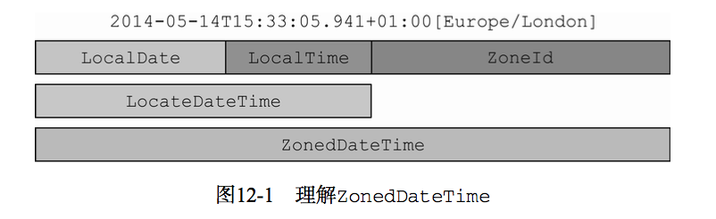

### java.time.*

java.util.Date：只能以毫秒的精度表示时间，且年从1900开始，月从0开始；时区支持不够，可变对象

java.util.Calendar：月从0开始，可变对象

DateFormat：不是线程安全的，可变对象

Joda-Time：第三方库，java8参考了较多

#### <a name="fenced-code-block">java8提供的日期和时间</a>

- `LocalDate`

  - 有3个主要属性：year, month, day
  - represents a date，只提供了简单的日期，不含时间信息，不含时区信息。如2007-12-03；
  - 除了各种方法构建LocalDate之外，还提供了很多针对year-month-day的"加减运算"，如：`plus(), plusYears(), plusMonths(), plusDays(),minus****()`
  - Combines this date with a time to create a LocalDateTime: `LocalDateTime atTime()`
  - `formart()`: Formats this date using the specified formatter.
  - Compares this date to another date：`compareTo(), isAfer(), isBefore(), isEqual()`
  - `with()`：以当前对象为模板，对某些状态进行修改，并创建该对象的副本

  - `TemporalAdjuster`：类中提供了许多针对日期的复杂操作的工厂方法，比如firstDayOfYear()将返回一个新的日期，它的值为当年的第一天。也可以创建自己的TemporalAdjuster

- `LocalTime`

  - 有4个主要属性：hour, minute, second, nano.前3个位byte类型(getHour()返回的是int)，nano为int
  - 表示时间，如19:15:30 or 13:45.30.123456789
  - 这里面定义了很多常量，比如：`MILLIS_PER_DAY`
  - 主要方法：`now(), of(), of***(), parse(), plus(), minus(), format(), compare(),  `

  ```java
  // with()：以当前对象为模板，对某些状态进行修改，并创建该对象的副本
  LocalTime time = LocalTime.now();
  System.out.println(time);																			// 11:20:19.460
  System.out.println(time.withHour(14));												// 14:20:19.460
  System.out.println(time.with(ChronoField.HOUR_OF_DAY, 14));		// 14:20:19.460
  System.out.println(time);																			// 11:20:19.460
  
  System.out.println(time.plusHours(5));
  System.out.println(time.plus(5, ChronoUnit.HOURS));
  System.out.println(time.minusHours(5));
  System.out.println(time.minus(5, ChronoUnit.HOURS));
  ```

- `LocalDateTime`

  - 面向人的日期时间，是LocalDate和LocalTime的合体，不含时区信息。如2007-12-03T10:15:30，

    the value "*2nd October 2007 at 13:45.30.123456789*" can be stored in a LocalDateTime

  - 有2个主要属性：date(LocalDate), time(LocalTime)

  - 主要方法：`now(), of(date, time), ofInstant(), parse(), get***(), with***(), plus(), minus(), formar(), compare(),  `

  ```java
  LocalDateTime now = LocalDateTime.now();
  System.out.println(now); // 2019-03-17T13:46:03.658
  
  LocalDateTime ldt = LocalDateTime.parse("2019-03-17T13:46:03.658");
  System.out.println(ldt);
  
  System.out.println(ldt.toLocalDate());  // 2019-03-17
  System.out.println(ldt.toLocalTime());  // 13:46:03.658
  
  System.out.println(ldt.getDayOfYear()); // 76
  System.out.println(ldt.get(ChronoField.DAY_OF_YEAR));   // 76
  System.out.println(ldt.getMonth());     // MARCH
  System.out.println(ldt.getMonthValue());// 3
  
  System.out.println(ldt.with(ChronoField.MONTH_OF_YEAR, 8));// 2019-08-17T13:46:03.658
  System.out.println(ldt.withMonth(8));   // 2019-08-17T13:46:03.658
  
  LocalDateTime.parse("2011-12-03T10:15:30", DateTimeFormatter.ISO_LOCAL_DATE_TIME);
  System.out.println(ldt.plus(14, ChronoUnit.MINUTES));  // 2019-03-17T14:00:03.658
  System.out.println(ldt.plusMinutes(14));// 2019-03-17T14:00:03.658
  
  DateTimeFormatter formatter = DateTimeFormatter.ofPattern("yyyy/MM/dd HH:mm");
  System.out.println(ldt.format(formatter)); // 2019/03/17 13:46
  System.out.println(LocalDateTime.parse("2019/03/17 13:46", formatter)); // 2019-03-17T13:46
  
  System.out.println(now.compareTo(ldt)); // 1
  System.out.println(ldt.compareTo(now)); // -1
  System.out.println(now.compareTo(now)); // 0
  System.out.println(now.isAfter(ldt));   // true
  System.out.println(now.isBefore(ldt));  // false
  ```

- `Instant`

  - [An instantaneous point on the time-line](<https://docs.oracle.com/javase/8/docs/api/java/time/Instant.html>). (时间线上的瞬时点)，面向机器的时间戳，从1970.1.1开始所经历的秒数进行计算，在此之前的日期用负数表示，精度包含nano. This class is immutable and thread-safe.
  - 有2个主要属性：seconds(long), nanos(int)

  ```java
  System.out.println(Instant.now());  // 2019-03-17T09:33:15.724Z  少了8个小时？
  System.out.println(new Date(System.currentTimeMillis()));// Sun Mar 17 17:33:15 CST 2019
  
  System.out.println(Instant.now().toEpochMilli());   // 1552805942531
  System.out.println(System.currentTimeMillis());     // 1552805942532
  ```

- `Duration`

  * A time-based amount of time, such as '34.5 seconds'. (基于时间的*时间量*，如34.5秒)
  * 主要用于以秒和纳秒衡量时间的长短

- `Period`

  - A date-based amount of time in the ISO-8601 calendar system, such as '2 years, 3 months and 4 days'. (ISO-8601日历系统中基于日期的*时间量*，如“2年3个月4天”。)
  - 以年月日的方式对多个时间单位建模

为了更好地支持函数式编程，以上表示时间的对象，都是不可修改的，确保线程安全。如果需要修改对象，可以使用withAttribute()方法，该方法会创建对象的一个副本，并按要求修改指定的属性，如：`LocalDate.now().withYear(2018);` 返回的日期表示是2018年

- `DateTimeFormatter`
  - *TODO: source code!*
  - 该类的实例是线程安全的！

* `ZoneId`

  java8中的`java.time.ZoneId`是老版的`java.util.TimeZone`的替代，该类的设计目标就是简化java中时区的处理。时区是按照一定的规则将区域划分成的标准时间相同的区间。在`ZoneRules`类中包含40个这样的实例。可以通过ZoneId的getRules()得到指定时区的规则。每个特定的ZoneId都有由一个特定的地区ID标识。比如：`ZoneId romeZone = ZoneId.of("Europe/Rome")`

  其中，地区ID都为"{区域}/{城市}"的格式，可以通过ZoneId提供的toZoneId()将一个老的时区对象转换为ZoneId：`ZoneId zoneId = TimeZone.getDefault().toZoneId()`

  得到ZoneId之后，就可以将ZoneId和LocalDate/LocalDateTime/Instant对象整合起来，构造为一个`ZonedDateTime`实例，它代表了相对于指定时区的时间点。

  

* immutable and unmodifiable!

